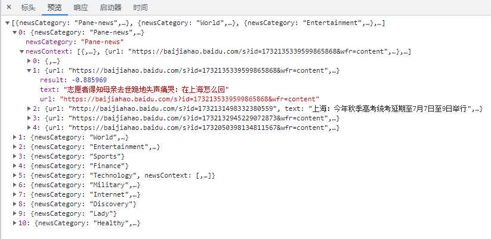
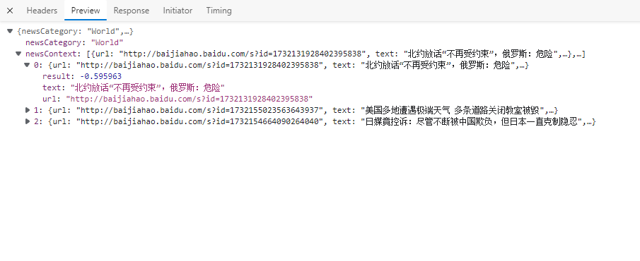

### 本项目是一个基于Golang的Colly框架搭建的百度新闻爬取、分析学习项目，可以实时查看新闻标题的情感分析.

## 🚩 **New Features/Updates**

- ✅ 百度新闻首页不同类别新闻的爬取方法
- ✅ 使用协程机制，将爬取新闻服务与新闻路由服务进行异步
- ✅ 定时自动爬虫新闻，并判断是否更新
- ✅ Log化项目
- ✅ 提供多种丰富情感分析Api

## 🔧 Dependencies and Installation

```##
#Dependencies
Golong 1.18
Colly  v2.1.0
gin  v1.7.7
cron v1.2.0


#installation
go mod init spider
go mod tidy

```

## ⚡️ API

我们将情感分析百度新闻的服务部署在了阿里云服务器，公网IP为139.224.17.6。如果想在本地进行调试，可以将IP信息替换为127.0.0.1

```
#获取所有类别负面新闻
139.224.17.6:8080/AllNews

#获取世界类别负面新闻
139.224.17.6:8080/News/World

#获取娱乐类别负面新闻
139.224.17.6:8080/News/Entertainment

#获取体育类别负面新闻
139.224.17.6:8080/News/Sports

#获取财经类别负面新闻
139.224.17.6:8080/News/Finance

#获取科技类别负面新闻
139.224.17.6:8080/News/Technology

#获取军事类别负面新闻
139.224.17.6:8080/News/Military

#获取互联网类别负面新闻
139.224.17.6:8080/News/Internet

#获取探索类别负面新闻
139.224.17.6:8080/News/Discovery

#获取女士类别负面新闻
139.224.17.6:8080/News/Lady

#获取健康类别负面新闻
139.224.17.6:8080/News/Healthy

```

## 🐢 View(公网接口请求示意图)

获取所有类别负面新闻展示截图



获取世界类别负面新闻



## ⏳  TODO LIST

* 数据库持久化以往新闻内容
* 配置信息JSON化

* Dokcer化，保证项目的自动运维
* 前端页面

## 🌏 致谢

本实习项目由梁斌大佬提供，在此由衷感谢梁博给我这一次做爬虫项目的机会！
